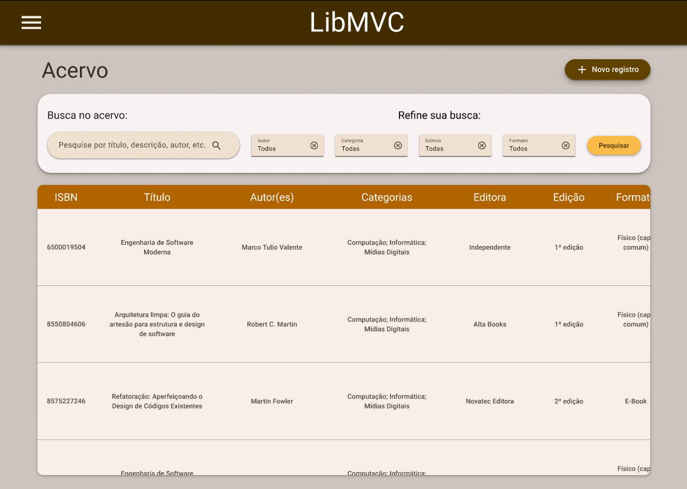
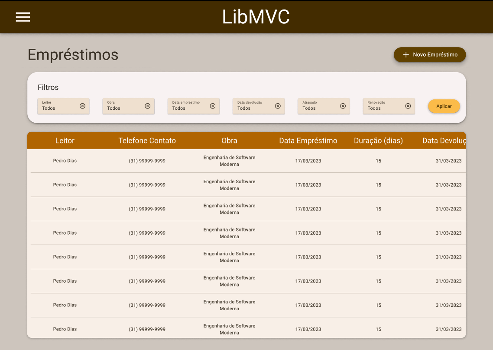

# LibMVC (Backend)

O **LibMVC** é um sistema mínimo para gerenciamento de bibliotecas, que conta
com funcionalidades para gerenciamento do acervo de uma biblioteca e dos
empréstimos realizados por esta. O sistema apresenta uma interface simples, em
formato de tabela, que permite ao usuário:

- Cadastrar informações sobre os livros do acervo (como título, autores, número
de cópias disponíveis, localização dos livros, etc.);
- Consultar as obras disponíveis no acervo;
- Atualizar e remover obras do acervo;
- Cadastrar empréstimos de livros informando: dados do leitor (como nome e
telefone), livro a ser emprestado, data de início e duração do empréstimo;
- Consultar os empréstimos em andamento, tendo acesso facilitado, por meio da
aplicação filtros, à informações como:
  - Todos os empréstimos cadastrados para uma determinada obra
  - Empréstimos realizados para um determinado leitor
  - Empréstimos feitos ou que vencem em uma determinada data
  - Empréstimos que estão atrasados
  - Empréstimos que são renovações (i.e., extendem o prazo de um empréstimo
    anterior);
- Atualizar informações de um empréstimo;
- Finalizar um empréstimo.

As funcionalidades anteriores são divididas em duas "telas", sendo uma dedicada ao
gerenciamento do acervo e outra, ao gerenciamento dos empréstimos. Um *mockup*
da interface do sistema pode ser visto nas imagens abaixo:

O objetivo da implementação desse sistema é dar suporte às análises comparativas
de *frameworks* JavaScript para o desenvolvimento de interfaces gráficas
(*frontend*), que serão feitas em meu trabalho de conclusão do curso de
Graduação em Ciência da Computação (Projeto Orientado em Computação), na
Universidade Federal de Minas Gerais (UFMG).

Este repositório contém apenas o código desenvolvido para implementação do
*backend* do sistema **LibMVC**, que consiste em uma API REST baseada em
documentos JSON (utilizados para a troca de informações entre o *frontend* e o
*backend*). Essa API será consumida pelas diferentes implementações do
*frontend*, cujos códigos estão armazenados em um repositório dedicado, que pode
ser encontrado nesse [link]().

## Tecnologias

O *backend* do sistema foi desenvolvido utilizando a linguagem
[TypeScript](https://www.typescriptlang.org/), utilizando:

- [Node.js](https://nodejs.org/en), um ambiente de execução para a linguagem
JavaScript externo aos navegadores, permitindo execução de programas JavaScript
em servidores
- [Express](https://expressjs.com/), um *framework* que facilita a construção de
aplicações Web (especialmente APIs REST) utilizando o Node.JS
- [MongoDB](https://www.mongodb.com/), um Sistema de Gerenciamento de Banco de
Dados (SGBD) orientado a documentos (No-SQL)
- [Zod](https://zod.dev/), uma biblioteca para validação do esquema de objetos
(*schema validation*), integrada ao sistema de tipos da linguagem TypeScript.
- [DotEnv](https://github.com/motdotla/dotenv#readme), uma biblioteca que
permite o carregamento fácil de configurações armazenadas em um arquivo `.env`,
por meio de variáveis de ambiente

## Instalação e Utilização

Instruções para instalação e utilização do *backend* do **LibMVC**, incluindo
um detalhamento de todos os *endpoints* disponibilizados pela API podem ser
encontradas nesse [link](./docs/instalacao.md).

## Arquitetura

Um detalhamento da arquitetura utilizada para implementação do *backend* pode
ser encontrado nesse [link](./docs/arquitetura.md).
