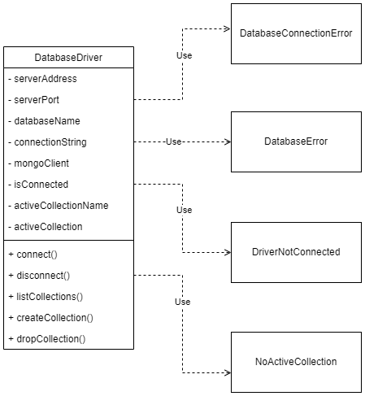

# Arquitetura do *Backend*

Fortemente baseada na clássica [arquitetura
MVC](https://martinfowler.com/eaaDev/uiArchs.html#ModelViewController) a
arquitetura escolhida para a aplicação SimpleLibrary também divide a
implementação das funcionalidades do sistema em três grandes "módulos" que, na
arquitetura MVC, correspondem aos modelos (*Models*), visualizações (*Views*) e
controladores (*Controllers*). Na arquitetura MVC, a camada de modelos é
composta elementos (objetos) do domínio da aplicação, que são também são
denominados "modelos". Esses objetos de domínio são mantidos separados de suas
representações na interface gráfica, que são implementadas pelas visualizações
(ou *views*) que, por sua vez, compõem a camada de mesmo nome. Por fim, a camada
de controladores é responsável por implementar o tratamento das entradas do
usuário, funcionando como uma espécie de sistema de entrada e saída (I/O). Um
controlador é responsável por receber as entradas do usuário e tratá-las,
reportando erros e garantindo que as ações correspondentes a essas entradas
serão propagadas para os modelos e, consequentemente, persistidas no sistema.

Conforme mencionado anteriormente, a arquitetura implementada neste trabalho,
assim como a MVC, também divide a aplicação em três grandes "camadas", porém,
devido às especificidades da plataforma Web, a forma como essas camadas
funcionam se difere um pouco de sua concepção original na arquitetura MVC. Como
a Web impõe uma "quebra" na implementação da aplicação, em que parte do sistema
deve executar em um servidor e parte nos computadores dos clientes (que acessam
a página/aplicação por meio de seus navegadores), é necessário criar um
desacoplamento ainda mais forte entre essas camadas. No caso desta aplicação,
por se tratar de uma API REST, essa "quebra" é feita entre os controladores e as
*views*, de modo que toda a lógica da aplicação executa no servidor e os
clientes ficam limitados a, basicamente, exibir a interface gráfica (os chamados
*thin clients* ou "terminais burros"). A pesar disso, certas partes do cliente
ainda implementam funcionalidades que poderiam ser atribuídas aos controladores
e mesmo aos modelos, sendo esse um dos motivos pelos quais esta aplicação não
utiliza "formalmente" a arquitetura MVC em sua concepção "clássica".

Embora a aplicação como um todo não siga "rigorosamente" as definições da
arquitetura MVC, o *backend* é a parte que mais se aproxima de uma implementação
MVC "tradicional". O *backend* da aplicação implementada, está dividido em duas
grandes camadas, sendo uma camada de modelos e uma camada de controladores, que
são análogas às da MVC. Além dessas, existe uma camada "menor" dedicada à
comunicação com o banco de dados, que funciona como um intermediário para a
comunicação com o sistema de gerenciamento de dados
[MongoDB](https://www.mongodb.com/). Por fim, há também uma camada responsável
por configurar a comunicação em rede, lidando com as requisições HTTP e o
processamento dos documentos JSON recebidos como entrada e/ou gerados como saída
no corpo dessas requisições. Essa última camada é implementada com o apoio do
*framework backend* [ExpressJS](https://expressjs.com/), ferramenta que facilita
a implementação de APIs REST.  O diagrama a seguir apresenta uma visão geral da
arquitetura do *backend* do sistema.

A seguir, as camadas que compõem o *backend* serão detalhadas individualmente.

## Camada de rede

Conforme mencionado anteriormente, a camada de rede é a responsável por lidar
com a comunicação em rede (via requisições HTTP) do lado do servidor que
implementa o *backend* do sistema. Essa camada é fortemente dependente do
*framework* [ExpressJS](https://expressjs.com/), sendo, portanto, bem simples,
consistindo em apenas uma classe, denominada `App`, que é responsável por
inicializar o servidor, além de receber e processar as requisições HTTP. A
inicialização do servidor envolve tarefas como: leitura de configurações a
partir de variáveis de ambiente, inicialização dos controladores, definição das
rotas e associação destas com seus respectivos controladores (que, de fato,
implementam suas funcionalidades), definir configurações gerais para a API REST
(como habilitar o CORS, tratamento de erros e de acesso a URLs inválidas, etc.),
dentre outras. Cada uma dessas responsabilidades é mapeada em um método privado
da classe `App`. Esses métodos, por sua vez, são executados pelo método público
`initialize()`. Uma visão geral da definição da classe `App` pode ser vista no
diagrama UML abaixo:

Além dos métodos privados responsáveis pelas tarefas de inicialização
mencionados anteriormente, é possível verificar, no diagrama anterior, que a
classe `App` possui também alguns campos privados, responsáveis por armazenar as
configurações do servidor, além do campo `expressApp`, que contém uma instância
da classe de mesmo nome do *framework* [ExpressJS](https://expressjs.com/), que
é a responsável pela implementação da comunicação em rede e processamento de
requisições. Essa instância têm seus parâmetros customizados pelo método
`initialize`, de acordo com as configurações das variáveis de classe. Nesse
momento, são definidas as duas rotas base da API: `/books` e `/loans`, que são
associadas aos seus respectivos controladores, responsáveis por implementar as
operações disponibilizadas. Por fim, o método `listen` apenas ativa o objeto
`expressApp`, deixando o servidor disponível para receber requisições se esse
processo é concluído com sucesso.

## Camada de controladores

Na camada de controladores, é implementada uma hierarquia de classes
responsáveis por implementar as operações fornecidas pela API para cada uma de
suas rotas base (`/books` e `/loans`), conforme especificado nas [instruções de
utilização](instalacao.md). Essa camada é composta por classe abstrata
`Controller` — responsável por inicializar os modelos e pelo gerenciamento das
rotas da API, associando cada *endpoint* a um método que o implementa
(*handler*) — e por duas classes concretas denominadas `BookController` e
`LoanController`, responsáveis por implementar os endpoints da API relativos à
entidade que representam (i.e., livros e empréstimos, respectivamente), além de
definir quais serão as rotas (URLs) para acessar esses recursos e a quais
métodos estarão associadas. O diagrama de classes UML a seguir apresenta a
estrutura dessa camada e das classes envolvidas:

Conforme mencionado anteriormente, as classes concretas `BookController` e
`LoanController` são compostas apenas por métodos, sendo que seus métodos
públicos implementam as operações disponibilizadas pela API (como recuperar os
dados de um livro/empréstimo pelo ID, registrar um novo livro, etc.). Além
desses métodos, essas classes também implementam dois métodos abstratos da
classe `Controller`, que são: o método `initalizeModels()`, responsável por
inicializar os modelos utilizados pelo controlador, e `initializeRoutes()`,
responsável por definir os endpoints associados à entidade que representa e
relacioná-los a um de seus métodos e utilizando, para tanto, o método
`registerRoute()`, de sua classe-pai (`Controller`). A pesar de depender
fortemente dos modelos, as classes dos controladores não possuem uma instância
das classes do modelo como um de seus campos, interagindo com estas via métodos
estáticos. Quando é necessário utilizar instâncias dessas classes, estas ficam
restritas ao escopo dos métodos das classes e são criadas utilizado o padrão
fábrica, com esses objetos sendo retornados também por métodos estáticos.

A classe abstrata `Controller`, por sua vez, possui alguns campos que são: o
campo `isReady`, um booliano que reporta o status da inicialização dos
controladores para as classes filhas, e o campo `router`, que contém um objeto
do *framework* express responsável por representar a URL base associada à
entidade do controlador, sendo utilizado para associar os métodos aos
respectivos endpoints. Além do já mencionado método `registerRoute()` e dos
métodos abstratos `initalizeModels()` e `initializeRoutes()`, a classe
`Controller` implementa: o método auxiliar `asyncHandlerWrapper()`, utilizado
para executar e tratar exceções de *handlers* assíncronos (que são a maioria); o
método `initializeController()`, chamado pela classe `App`, que apenas chama os
métodos abstratos para inicialização dos componentes envolvidos (i.e. modelos e
rotas) e o método `bindRoute()`, também chamado pela classe `App`, que associa o
controlador a uma URL base.

## Camada de Modelos

Assim como a camada de controladores, a camada de modelos também é implementada
como uma hierarquia de classes, responsáveis por representar, como objetos, as
entidades da aplicação (livros e empréstimos) e por intermediar as operações
realizadas sobre elas, lidando com questões como consistência dos dados e a
conversão entre as representações do banco (documentos) e do *backend* da
aplicação (objetos). Essa camada é composta por classe abstrata (`Model`) e duas
classes concretas (`Book`e `Loan`), associadas às entidades da aplicação (livros
e empréstimos). A seguir, é apresentado o diagrama UML que representa a
estrutura dessa camada.

A classe `Model` possui um campo `id`, que contém o ID do documento do MongoDB
associado à instância atual da classe; um campo `changeSet`, que registra todas
as modificações feitas na instância atual, com suas chaves correspondendo às
chaves alteradas e, os valores, ao conteúdo atualizado e um campo `collection`,
que contém uma instância de um objeto associado à coleção do MongoDB, retornado
pela camada de conexão ao banco de dados. Essa classe também implementa os
seguintes métodos concretos: `wasEdited()`, que retorna um booliano indicando se
o modelo foi modificado ou não; `commitChanges()`, que persiste qualquer
modificação feita no modelo no banco de dados e redefine o `changeSet` e
`delete()`, que remove o documento associado à instância atual do banco de
dados. Além desses, também são implementados os métodos estáticos:
`isValidId()`, que verifica se uma string representa um ID válido do MongoDB;
`getIdFromString()`, que retorna um objeto responsável por representar um ID do
MongoDB nas operações do banco de dados; `addNew()`, que insere um novo
documento no banco de dados e `deleteById()`, que remove um documento dado o seu
ID.

Além dos métodos concretos, a classe `Model` também implementa os métodos
abstratos `getAllFields()` e `reload()`, responsáveis por retornar um objeto
(JavaScript) contendo os valores de todos os campos da instância atual e
recarregar os dados da instância atual a partir do banco de dados,
respectivamente. Ambas as classes concretas também possuem uma variável estática
`modelCollection`, análoga à variável `collection` das instâncias, porém
utilizada para as operações estáticas da classe, e implementam um método
estático `initializeModel()`, responsável por efetivar uma conexão com o banco
de dados, associada a coleção correspondente, que também faz parte da
"interface" dessas classes. Outro ponto em comum entre as classes concretas é
que os campos contendo os dados da entidade são privados, possuindo *getters* e
*setters* associados, de modo que os métodos "*set*" são utilizados para
registrar as modificações feitas na instância do modelo, para posterior
persistência, enquanto os métodos "*get*" apenas garantem o encapsulamento
desses valores (embora esses métodos não estejam representados no diagrama
anterior, para deixá-lo mais "compacto").

Por fim, os campos classes `Book` e `Loan` são associados aos campos do
documento da entidade associada no MongoDB e, no caso da classe `Loan`, também
existem *getters* associados a alguns atributos dos empréstimos que são
computados no backend (i.e. não são armazenados no banco de dados), como a
duração do empréstimo e o booliano que indica se o empréstimo está atrasado ou
não, por exemplo. Essas classes também implementam métodos estáticos para criar,
recuperar e deletar documentos no banco de dados. Os métodos que recuperam
instâncias (por ID, busca e/ou outros filtros), são métodos "fábrica", sendo
esta a única forma de instanciar essas classes. No caso da classe `Book`, também
são implementados os métodos `addCategory()` e `removeCategory()`, que permitem
adicionar/remover categorias associadas ao livro atual.

## Camada de dados

Assim como a camada de rede, a camada de dados também é fortemente baseada em
uma ferramenta externa, nesse caso, a [API do
MongoDB](https://www.mongodb.com/docs/drivers/typescript/) para a linguagem
TypeScript sendo, portanto, bastante simples e composta por apenas uma classe
principal (denominada `DatabaseDriver`) e duas classes para exceções
customizadas que auxiliam no processo de tratamento de erros associados ao banco
de dados no *backend*. A classe `DatabaseDriver` é uma implementação do padrão
de projeto fachada para a API do MongoDB, representando, portanto, uma interface
mais simples para utilização dessa API. O diagrama UML abaixo apresenta as
classes que compõem essa camada:

A classes `DatabaseDriver` é composta por campos que contém configurações da
conexão com o banco de dados, que são: `serverAddress`, `serverPort`,
`databaseName`, `connectionString`. Esses campos armazenam, respectivamente, o
endereço (URL), a porta, o nome do banco de dados e a string de conexão do
MongoDB. Além destas, temos as variáveis `mongoClient`, que contém um objeto da
API do MongoDB que representa a conexão atual ao banco; `isConnected`, que
contém um valor booliano que indica se existe uma conexão ativa com o banco de
dados; `activeCollectionName`, que contém o nome da coleção-alvo das consultas
executadas pela instância do driver, e `activeCollection`, que contém um objeto
da API do MongoDB associado à coleção selecionada, utilizado para realizar as
consultas.

Os métodos implementados pela classe são: `connect()`, que inicia uma nova
conexão com o banco de dados; `disconnect()`, que finaliza a conexão atual com o
banco de dados; `listCollections()`, que retorna uma lista dos nomes das
coleções disponíveis no banco de dados ao qual o driver está conectado;
`createCollection()`, que cria uma nova coleção e `dropCollection()`, que remove
a coleção atual do banco de dados. A classe também implementa *getters* para as
variáveis `connectionString`, `databaseName`, `activeCollectionName` e
`isConnected`, além de um *setter* para a variável `collectionName`, que permite
atual a coleção atualmente selecionada, modificando o objeto associado à coleção
atual (`activeCollection`), além de definir o nome da coleção selecionada
(`activeCollectionName`).

Por fim, a classe também replica parte da interface da API do MongoDB para
realização das operações no banco de dados, apenas chamando métodos
correspondentes dos objetos `mongoClient` ou `activeCollection`, repassando os
parâmetros. A fim de simplificar o diagrama, esses métodos, assim os *getters* e
*setters* mencionados anteriormente foram omitidos. A associação desses métodos
aos seus correspondentes na API do MongoDB também é feita com o uso de
*getters*, que retornam uma referência para o respectivo método do objeto
`collection`, já associado a essa instância. Isso permite que o chamador execute
um método do objeto `collection` (da API do MongoDB) diretamente, porém mantendo
o encapsulamento, uma vez que o objeto em si não é retornado. Esse mecanismo da
linguagem JavaScript facilita bastante a implementação desse padrão de projeto,
uma vez que simplifica o processo de "copiar" a interface do método-alvo e
retornar uma chamada a este, repassando todos os parâmetros.
